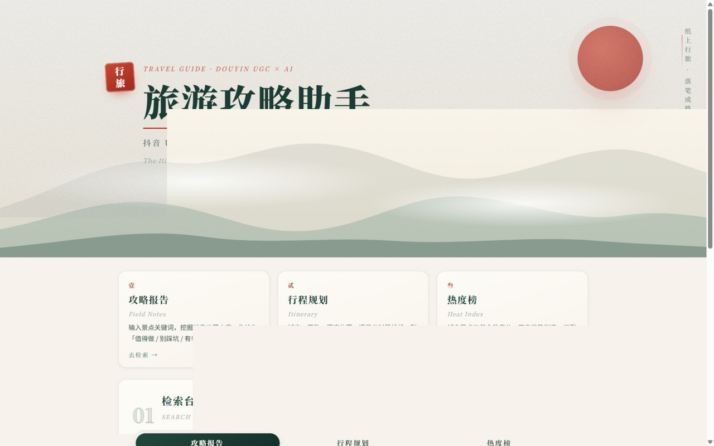
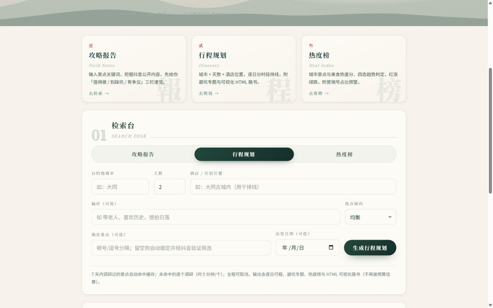
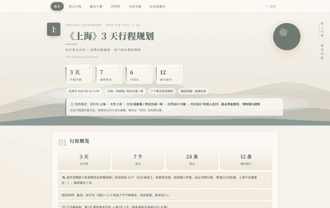

# TravelGuide Assistant（旅游攻略助手）

[](https://github.com/YC34512/TravelGuide-Assistant/actions/workflows/test.yml)

**基于抖音真实评论数据的避坑型智能行程规划器**：用户说想去哪旅游 → 大模型（基线知识）给出完整旅游清单建议 → 清单中的景点/网红店铺经浏览器采集验证，让数据更真实 → 生成含避坑专题与热度榜的逐日行程路书（Markdown + HTML 可视化）。

**先看效果（无需安装任何东西）**：[示例路书 · 上海 3 天（Markdown，GitHub 上直接阅读）](examples/示例路书_上海3天.md) ｜ [可视化 HTML 版](examples/示例路书_上海3天.html)（下载后双击打开，含行程全景图、详情弹层与来源链接）。

## 三大核心卖点（不只是生成一份攻略）

1. **避坑提示**：每个行程点与避坑专题都附**评论原文引用 + 来源视频链接**——不只告诉你哪里好玩，还告诉你哪里会踩坑、坑长什么样；
2. **实时热度榜**：独立的城市级**本周最火 / 正在降温**榜单，基于抖音近 7 天/60 天内容分布判定；网页"热度榜"页签可一键刷榜（元数据轻量采集，不采评论，约 3~5 分钟）；
3. **真实评价摘要**：每个景点的好评与差评压缩成"一分钟读完"的摘要（总评/好评/差评/评论摘录），内嵌在行程报告的景点详情卡里——去之前查一下，方便又高效。

全链路来源可溯：每条要点带**量化置信度**——高（≥3 独立来源且无矛盾）/ 中（2 来源或轻微矛盾）/ 低（单源或来源疑似营销号，营销号不计入印证数），附独立来源数与视频链接；避坑提示按置信度降序排列。

数据源：内置**抖音**适配器；采集层与 `pipeline/` 通过统一数据模型解耦，新增平台只需实现同一套适配器接口。

## 界面预览

| 网页控制台（攻略 / 行程 / 热度） | 行程规划表单 |
|---|---|
|  |  |

HTML 可视化路书（示例：上海 3 天，即 `examples/` 下那份）——逐日时间线、行程全景图、避坑警示卡，每条要点附来源链接（下方动图为**全页滚动**，约 19 秒）：




> 截图中回显的目的地、天数与偏好均为示例参数，不含任何真实个人信息；来源链接为公开的抖音视频地址。

## 合规声明（请务必阅读）

- 采用**浏览器自动化**路线（DrissionPage）：以真实浏览器、普通用户身份访问，只读取登录后页面可见的内容；**不破解签名、不绕过风控、不碰登录墙后的非公开数据**。
- 评论数据**去标识化**：只保留评论文本与点赞数，评论者的昵称/头像/用户 ID 一律不采集、不存储（见 `core/sanitize.py`）。
- **频控保守**：请求间随机间隔 2.5~5 秒，单次运行限量（默认 10 条视频 × 100 条评论），模拟正常浏览节奏。
- **质量过滤**：点赞低于门槛的低质评论（表情/刷屏居多）自动丢弃，高赞不足时放宽保底。
- 报告为**分析引用**，不搬运、不分发原始内容；所有关键信息附来源链接。
- 请使用**采集专用小号**（自动化访问违反平台用户协议，账号可能被风控，勿用主力号）。
- 本项目仅供个人学习研究；商用前需重新评估合规并咨询专业意见。

### 开源合规架构：内核中立 + 采集源默认关闭

- **平台中立的分析内核**：`pipeline/` 只消费统一数据模型（`core/models.py`），不感知数据来自哪个平台；更换/新增数据源无需改内核。
- **抖音适配器默认关闭（opt-in）**：`SOURCE_DOUYIN_ENABLED` 默认 `false`。全新 clone **不发起任何平台采集**，本地已采缓存仍可读取。启用需在 `.env` 设 `SOURCE_DOUYIN_ENABLED=true`，**启用者自行承担责任**（遵守平台 ToS、仅个人/研究用途、采集专用小号）。
  - 不启用时两者的表现**不一样**，别被"kernel-only"四个字误导：**行程规划**会降级走 LLM 基线（不抛错，结果里标注 `collect_mode: kernel-only`）；而**攻略报告**会直接失败并给出启用指引——它的价值就是真实评论，没有素材时给出一份"基于大模型常识的攻略"反而是欺骗。第一次使用请照下面「安装」章节走一遍，其中第 4 步会让你决定要不要启用采集。
- **合规护栏默认开启**：频控（2.5~5s）、去媒体、评论去标识化为底线；启用 UGC 源前校验频控未被禁用（为 0 则拒绝启用）。
- **绝不碰绕过技术**：检测到验证码/风控中间页时**只停止本次会话采集**并回退缓存/基线，不尝试任何验证码破解或签名绕过；搜索与详情采集都会立即熔断，剩余点位不再逐个重试（避免反复撞风控）。
- **规范免责声明**：启用 UGC 源时运行时打印一次性免责告知；报告自带免责声明与来源链接。

## 开源与密钥安全设计

- 仓库中**永远不出现任何密钥**：API Key 只存在用户本机的系统凭据管理器中（`core/credentials.py`），配置向导在首次运行时引导每个用户填自己的 Key；
- Key 粘贴输入**不回显**（getpass），保存前先做真实调用验证，无效 Key 不落库；
- `.gitignore` 已排除 `.env`、`data/`、`browser_profile/`（含登录态）等所有本地敏感数据；
- 报告输出带免责声明与来源链接，原始内容不落库不分发。

## 安装（Windows 三步，约 10 分钟出第一份路书）

需要准备的只有两样：**Python 3.10+**（[官网下载](https://www.python.org/downloads/)，安装时**务必勾选 "Add to PATH"**；需 Chrome 或 Edge 浏览器，代码会自动检测）和**任意一家大模型的 API Key**（[阿里云百炼](https://bailian.console.aliyun.com/) / [DeepSeek](https://platform.deepseek.com/) / [智谱](https://open.bigmodel.cn/) / [Moonshot](https://platform.moonshot.cn/)，均有免费额度）。高德 Key 与抖音采集**全部可选**，不配也能跑。

0. **获取代码**：`git clone https://github.com/YC34512/TravelGuide-Assistant.git`，或在 GitHub 页 **Code → Download ZIP** 后解压；
1. 双击 **`install.bat`** —— 自动建虚拟环境、装依赖、自检（首次约几分钟，可重复执行）；
2. **配一次 API Key**：双击 **`运行.bat`**（不带参数）首次会自动弹出配置向导，配好后按 `Ctrl+C` 退出即可。直接启服务（第 3 步）时若还没配 Key，也会就地弹出同一个向导——两条路都行，不必记命令；
3. 双击 **`运行服务.bat`** —— 启动网页版，浏览器自动打开 `http://127.0.0.1:8000`（推荐）；或双击 `运行.bat` 走命令行交互；
4. （可选：要用到真实评论数据时）把 `.env.example` 复制为 `.env` 并设 `SOURCE_DOUYIN_ENABLED=true`，首次采集时按提示用**采集小号**扫码登录抖音（只需一次）。不启用也能跑通：行程规划降级走 LLM 基线，攻略报告则会明确报错并给出启用指引。

### 手动安装（macOS / Linux，或偏好命令行的 Windows 用户）

未在 macOS / Linux 真机充分验证，欢迎反馈问题；采集需要本机有 Chrome / Chromium（DrissionPage 自动检测）。

```bash
git clone https://github.com/YC34512/TravelGuide-Assistant.git
cd TravelGuide-Assistant
python3 -m venv .venv && source .venv/bin/activate   # Windows: .venv\Scripts\activate
pip install -r requirements.txt
python run_cli.py setup     # 配置 API Key（存入系统凭据管理器 / 钥匙串）
python run_server.py        # 启动网页版（或 python run_cli.py 走命令行）
```

## 配置 API Key（首次运行一次即可）

首次运行（双击 `运行.bat`，或启动服务时检测到未配置）会自动弹出配置向导：

1. 选择服务商（阿里百炼 / DeepSeek / 智谱 / Moonshot / 自定义）；
2. 粘贴你自己的 API Key（**输入不回显**）；
3. 程序自动发一次最小请求验证，通过后保存。

**Key 存储在操作系统级的加密凭据库中**（Windows 凭据管理器 / macOS 钥匙串），
不写入任何项目文件，不存在被提交到 Git 或随项目分享出去的可能。

- 重新配置：`运行.bat setup`（或 `python run_cli.py setup`）；
- 备选方式：也可以把 `​.env.example` 复制为 `.env` 手工填写（明文文件，已被 `.gitignore` 排除，安全性弱于凭据管理器）。

## 首次运行（抖音扫码，一次即可）

```bash
python main.py 西湖攻略 --no-llm
```

- 会弹出浏览器窗口，用**采集小号**扫码登录抖音（登录态保存在 `browser_profile/`，之后无需重复扫码）。
- 该命令只采集原始数据，结果存到 `data/raw/西湖攻略_时间戳.json`。

## 日常运行

```bash
python main.py 西湖攻略            # 采集 + 生成攻略报告
python main.py 武功山攻略 --limit 15  # 自定义采集量
```

或直接双击 `运行.bat`，按提示输入关键词。报告输出到 `data/reports/`。

## 服务模式（网页界面，推荐）

双击 `运行服务.bat`（或 `python run_server.py`），浏览器自动打开 `http://127.0.0.1:8000`：

> 可反复双击，不会起第二个实例——检测到服务已在运行时直接打开浏览器复用；端口被其他程序占用时会给出明确提示（可在 `.env` 改 `SERVER_PORT`）。

- 输入景点关键词 → 实时进度 → 页面直接阅读渲染好的报告；长任务可随时点"取消任务"，浏览器与采集资源会安全释放；
- **三档采集模式**：快速（5 视频）/ 标准（8 视频）/ 深度（10 视频 + 口播转写，出发前用）；
- **可取/不可取智能评价**：每条要点带立场（推荐/避雷/中性），报告开头生成「值得做/别踩坑/有争议」速览清单；多源交叉验证标注置信度（多源一致/单源/存分歧），立场对立的说法会被强制并列呈现；
- **口播转写**（深度模式）：本地 faster-whisper 推理，视频下载转写后即删，音频不出本机；转写文本随原始数据入库，缓存命中时零成本复用；
- **景点知识库**：采集成果沉淀在本地 SQLite（`data/knowledge.db`），关键词自动归一化（"西湖攻略"≈"西湖"），保鲜期内（默认 7 天，`KB_TTL_DAYS` 可配）重复查询免重爬，约 30 秒出报告；勾选"强制重新采集"可跳过缓存；
- **历史不丢**：任务终态（完成/失败/取消）与报告档案落库，服务重启后历史报告仍可浏览与下载；
- API 形态（可供其他程序/小程序调用）：`POST /api/research`、`POST /api/trip`、`POST /api/heat/refresh`、`GET /api/heat/{city}`、`GET /api/jobs/{id}`、`POST /api/jobs/{id}/cancel`、`GET /api/reports`、`GET /api/health`。

## 行程规划师（避坑型多天路书）

网页切到"行程规划"页签，输入**城市 + 天数 + 酒店**（可选：消费偏好、指定景点）即可生成逐日分时段路书：

1. **视频行程草案优先**：先从高赞攻略视频提炼逐日行程编排草案，LLM 审核增删改、对齐用户天数后作为规划主干（"先看热门视频怎么排"）；大模型再圈定 15~20 个候选（景点/美食/体验/购物；联网搜索默认关闭以免产生独立计费的搜索费，可在 `.env` 开启）→ 草案点位必进验证，逐个抖音验证采集（营销号文案自动过滤）→ 交叉验证筛选出 8~12 个优质候选（也可手动指定清单跳过验证）；
2. 逐个景点调研：7 天内调研过的自动命中知识库缓存，未命中的现场采集（约 5 分钟/个）；同步单独调研最多 3 家代表性餐厅/小吃（同样采评论做避坑分析）；
3. 每个景点与餐厅蒸馏结构化档案（建议时长/最佳时段/亮点/避雷/美食/打卡点/花费项）；
4. 具体交通方案：配置高德 Key 时逐路段给实测方案（公交/地铁线路+站数+票价+打车费用，1.5 公里内给步行）；未配置则降级为 LLM 交通估算（同样给线路/时长/费用，均标注"估算，以地图 App 为准"）；
5. **不做预算估算**：估算金额不可靠，报告只给行程规划、预算由用户自行考虑；行程内只保留调研到的确定门票价（标注来源），不拼总额；
6. 输出：逐时段卡片（景点+时长+交通+注意事项）+ **避坑专题（每条附评论原文引用与来源链接）** + **实时热度榜**（点赞/评论密度/近 90 天新鲜度）+ 景点详情卡与**餐厅详情卡（含避坑分析与真实评价摘要）** + **美食榜单（不排入行程时间线，按就近/人均自选）** + 全部来源；同时产出 Markdown 与 **HTML 可视化路书**（每日行程时间线/避坑警示卡/热度进度条，离线自动降级文本版）。

**独立热度榜**：网页"热度榜"页签输入城市即可查询/刷新——**景点榜与美食榜并列**；热度分 = 点赞 40%（对数归一）+ 评论密度 30% + 新鲜度 30%（近 90 天发布占比）；趋势四态判定（本周最火/长盛不衰/正在降温/平稳）基于近 7 天与 60 天以上的内容分布；每行附**营销号占比**（文案命中营销话术的视频占比，≥50% 红色预警）与**评论情感趋势**（近 30 天好评率与更早对比，判断是不是越做越差）。刷榜只采元数据（点赞与发布时间），仅每个对象首条视频加采评论供情感趋势，硬上限 6 景点 + 2 美食 × 4 视频。API：`POST /api/heat/refresh` + `GET /api/heat/{city}`（返回 `ranking` 与 `food_ranking`，含 `mkt_ratio`/`sentiment`）。

配置高德（可选但推荐）：[高德开放平台](https://lbs.amap.com/) → 控制台 → 创建"Web服务"类型 Key（个人每日 5000 次免费）→ 填入 `.env` 的 `AMAP_API_KEY`。

API 形态：`POST /api/trip {"city": "大同", "days": 3, "hotel": "大同古城内", "preference_mode": "均衡"}` → 返回 `job_id`，用 `GET /api/jobs/{id}` 轮询；结果额外含 `pitfall_digest` / `heat_rank` / `draft_plan`（视频行程草案）与 HTML 报告（`GET /api/reports/download?name=文件名`），不做预算估算。

## 目录结构

```
├── main.py              # CLI 入口：搜索 → 采集 → LLM → 报告
├── llms.txt             # 给 LLM 读的文档索引（llmstxt.org 格式）
├── CHANGELOG.md         # 版本变更记录
├── install.bat          # 一键安装：自动建 .venv 虚拟环境 + 装依赖 + 自检
├── run_server.py        # 服务入口：python run_server.py（或双击 运行服务.bat）
├── api_server.py        # FastAPI：网页 + 任务接口（含取消/历史/下载）
├── run_cli.py           # 双击运行.bat 的交互入口（含 API Key 配置向导）
├── report_from_raw.py   # 从已采集 JSON 重新生成报告（不重爬）
├── mcp_server.py        # MCP 服务器：把本项目暴露为标准工具（任意 MCP 客户端可用）
├── config.py            # 频控/限量/LLM/知识库配置（.env 可覆盖）
├── tests_offline.py     # 离线自测脚本（不调 LLM 不开浏览器）：python tests_offline.py
├── .qoder/skills/       # AI 代理技能：教 Qoder 代理通过 API 驱动本项目
├── core/
│   ├── models.py        # VideoItem / Comment / InfoPoint 统一数据模型
│   ├── credentials.py   # API Key 安全存取（系统凭据管理器）+ 配置向导
│   ├── knowledge.py     # 景点知识库 + 任务档案（SQLite，关键词归一化）
│   ├── geo.py           # 高德地图：POI 定位 + 通行时间（无 Key 自动降级）
│   ├── rate_limiter.py  # 随机间隔频控
│   ├── sanitize.py      # 评论去标识化 + 文本清洗（合规闸口）
│   ├── asr.py           # 本地口播转写（faster-whisper，转写后即删）
│   └── llm.py           # OpenAI 兼容客户端（JSON/重试/思考模式控制）
├── crawler/
│   ├── browser.py       # 浏览器会话、登录态管理（Chrome/Edge 自动检测）
│   └── douyin.py        # 抖音适配器：多角度搜索择优 / 视频详情 / 评论（选择器集中管理）
├── pipeline/
│   ├── extract.py       # Map：逐条视频提取要点 + 立场评价（附评论原文引用，防幻觉 + 噪声过滤）
│   ├── verify.py        # 多源交叉验证 + 立场冲突兜底 + 分批聚类 + 置信度分级
│   ├── report.py        # Reduce：汇总生成报告正文（值得做/别踩坑双面覆盖）
│   ├── candidates.py    # 混合候选生成（类别配额）+ 营销号过滤 + 交叉验证筛选（成本闸）
│   ├── heat.py          # 热度指数 + 三时间窗占比 + 四态趋势判定 + 避坑专题（纯函数）
│   ├── planner.py       # 行程规划：档案蒸馏 + 评价摘要 + 排程规范化（草案主干/排布兜底）+ 门票唯一口径
│   └── render.py        # 报告组装（速览清单 + 溯源清单 + 免责声明）
├── templates/
│   └── trip_report.html # 行程可视化模板（Jinja2：时间线 + 避坑警示卡 + 热度进度条，离线降级）
├── examples/
│   └── 示例路书_上海3天.*  # 免安装预览：一份完整生成结果（Markdown + 可视化 HTML）
├── assets/              # README 截图与动图（网页控制台 + 路书示例）
├── service/
│   ├── research.py      # 攻略任务编排：采集 → 提取 → 缺口补全 → 验证 → 报告（支持取消/重试）
│   ├── trip.py          # 行程任务编排：城市攻略层 → 视频草案审核 → 候选验证 → 逐点调研 → 档案/避坑/热度 → 排线
│   └── heatrefresh.py   # 热度刷榜任务：元数据轻量采集 → 四态趋势判定 → 快照落库
├── web/
│   └── index.html       # 网页界面
└── data/
    ├── knowledge.db     # 景点知识库 + 任务档案
    ├── raw/             # 原始采集 JSON（含转写文本）
    ├── reports/         # 生成的攻略报告
    └── debug/           # 页面处理失败时的 HTML 快照
```

## 页面改版了怎么办（搜到 0 条 / 评论 0 条）

抖音网页结构调整会导致选择器失效。处理方式：

1. 查看 `data/debug/` 下的失败页面 HTML 快照（服务模式会自动保存并在日志中告警）；
2. 浏览器 F12 确认新版页面结构；
3. 只改 `crawler/douyin.py` 顶部的 `SEL_*` 选择器常量，业务逻辑不用动。

## 常见问题

| 现象 | 原因与处理 |
|---|---|
| 提示未检测到登录态 | 在弹出的浏览器窗口中用**采集小号**扫码；登录态保存在 `browser_profile/`，一次即可 |
| 搜到 0 条结果 | 未登录、关键词过冷或页面改版；按上节步骤查 `data/debug/` 快照 |
| API Key 无效/欠费报错 | `运行.bat setup`（或 `python run_cli.py setup`）重新配置；欠费需到服务商控制台处理 |
| 提交任务报"未配置 API Key" | 还没配 Key：双击 `运行.bat` 或启动服务时都会自动弹出配置向导；也可手动 `python run_cli.py setup` |
| 启动服务提示端口被占用 | 8000 端口被其他程序占用：关闭占用程序，或在 `.env` 里改 `SERVER_PORT`（如 8001）后重试 |
| 报错含 `AllocationQuota.FreeTierOnly` | 该模型免费额度已用尽；换成仍有额度的模型：`python run_cli.py setup` |
| 任务跑到一半想停 | 网页版点"取消任务"（当前步骤结束后生效，浏览器安全释放） |
| 服务重启后看不到进行中的任务 | 终态任务已落库：网页历史报告卡片仍可浏览/下载；运行中的任务重启后视为中断，需重新发起 |
| 报告缺"门票/交通"章节 | 系统会自动定向补采一轮；仍缺失说明抖音上确实没有相关素材 |
| 装依赖很慢/失败 | 用国内镜像：`pip install -r requirements.txt -i https://pypi.tuna.tsinghua.edu.cn/simple` |

## AI Agent Skill（附赠）

仓库内置了 Qoder 代理技能 `.qoder/skills/travel-guide-research/`：在 Qoder 中打开本项目后，
直接对 AI 说"查一下西湖的攻略"，代理会自动启动服务、发起采集、轮询进度并交付报告，
还能基于报告继续做行程规划。非 Qoder 用户可把它当作一份完整的 API 调用文档读。

**注意：技能只是驱动壳**——依赖安装与 API Key 配置仍需先按上文「安装」完成（缺 Key 任务必定失败）；Skill / MCP 免去的是手工操作，不替代这两步。详见技能内「前置条件」一节。

## 接入其他 AI 智能体（OpenAI 兼容 / MCP）

本项目不止服务 Qoder：任何支持工具调用的智能体都能接入，三条路任选：

**1. OpenAPI 导入（Dify / Coze / GPTs Actions / n8n / LangChain）**

服务启动后，OpenAPI 规范自动生成：
- 交互式文档：`http://127.0.0.1:8000/docs`
- 规范 JSON：`http://127.0.0.1:8000/openapi.json`（直接粘进各平台的 API 导入入口）
- 调用链：`POST /api/research` → 每 20 秒轮询 `GET /api/jobs/{id}` → `result.markdown` 即报告

**2. MCP 接入（Claude Desktop / Cursor / Cherry Studio / Cline 等）**

仓库自带 `mcp_server.py`（stdio 传输，10 个工具：服务探测 / 发起攻略 / 发起行程 / 查城市热度 / 刷榜 / 查进度 / 取消 / 历史报告列表 / 读报告 / **打开网页**）。客户端配置（Claude Desktop / Cursor / Cherry Studio / Cline / **WorkBuddy** 等）：

```json
{
  "mcpServers": {
    "travel-guide": {
      "command": "python",
      "args": ["C:/路径/到项目/mcp_server.py"]
    }
  }
}
```

目标服务地址可用环境变量 `TG_SERVER_URL` 覆盖（默认取 `config.py` 的
`SERVER_HOST` / `SERVER_PORT`，即 `http://127.0.0.1:8000`）。

**MCP 会按需自动拉起服务**：任何工具调用先探一次 `/api/health`，不通就在后台起一个
uvicorn（刻意不弹浏览器，输出写进 `data/debug/server_autostart.log`），就绪后继续
执行原调用。所以 MCP 客户端这边不需要先手动双击 `运行服务.bat`。指向远端服务
（`TG_SERVER_URL` 非本机）时不会自动拉起。

**注意**：自动拉起的只是"服务"——依赖与 API Key 仍需先按「安装」配好，MCP 不会代劳配置；缺 Key 时任务会以"未配置 API Key"明确报错。

**3. 通用系统提示词（任何支持自定义提示词的智能体）**

> 你可以调用旅游攻略助手 HTTP API（基址 http://127.0.0.1:8000）：
> 用 POST /api/research（body: {"keyword": "景点", "mode": "standard"}）发起任务，
> 每 20 秒 GET /api/jobs/{job_id} 轮询，status 为 done 时取 result.markdown 作为报告；
> 报告含置信度分级（多源一致/单源/存分歧）与来源链接，转述时不得丢弃来源；
> error 含"登录态"提示用户扫码，含"选择器失效"提示维护 crawler/douyin.py 的 SEL_* 常量。

**4. 让 LLM 直接读文档：[`llms.txt`](llms.txt)**

仓库根目录的 `llms.txt`（[llmstxt.org](https://llmstxt.org/) 格式）把项目文档整理成
一份**带注释的索引**：核心文档入口、运行时接口、以及智能体必须遵守的约定（来源链接不得省略、
不做预算估算、未启用采集时两类任务的表现差异）。把它的 URL 丢给任何 LLM，比让它自己爬仓库准得多。

## 开发与自测

改动后跑一遍离线自测（不调 LLM、不开浏览器，不消耗额度）：

```bash
python tests_offline.py
```

覆盖：关键词归一化、速览清单、立场冲突兜底、验证降级、评论过滤、时效判断、任务落库与取消、API 防目录穿越、搜索择优排序、缺口检测、作者回复识别、行程档案/规划规范化与路书渲染、高德降级路径。

仓库已配置 GitHub Actions：每次 push / PR 自动执行语法检查与全部离线测试（见顶部徽章）。

## 许可证与责任声明

本项目基于 [MIT License](LICENSE) 开源，仅供**个人学习与研究**使用。
使用者有责任自行评估并遵守目标平台的用户协议与当地法律法规；
因使用本项目产生的一切后果（包括但不限于账号风控、平台处罚）由使用者自行承担。
